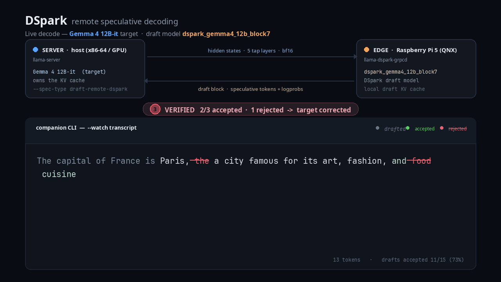
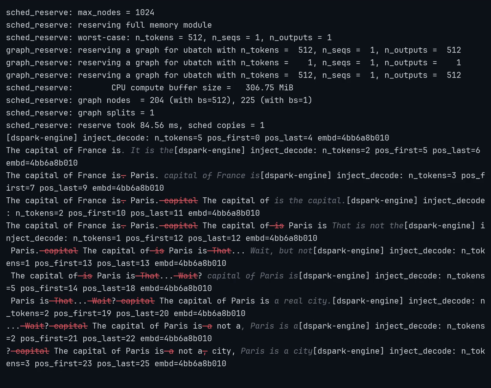

# dspark-edging

Remote DSpark speculative decoding over gRPC for llama.cpp.

The server runs the full target LLM and owns the KV cache. The edge device
(Raspberry Pi 5 for the hackathon, any Linux box for development) runs only the
lightweight DSpark draft model. Per-token target hidden states from 5 tap layers
cross the wire; the target KV cache never leaves the server.

## How the data flows

A live decode of **Gemma 4 12B-it** (the target) with
`dspark_gemma4_12b_block7` as the speculative-decoder draft model. The animation
tracks one round trip per draft block:

[](docs/media/dspark-dataflow.mp4)

- **Server → edge (top wire):** for every accepted token the server emits its
  target hidden states — 5 tap layers, `bf16` — and streams them to the edge.
  This is *all* that leaves the server; the target KV cache stays put.
- **Edge → server (bottom wire):** the edge injects those hidden states into its
  local draft KV cache, runs the DSpark draft model, and sends a **draft block**
  of speculative tokens (with logprobs) back for the server to verify.
- **Between them (companion-CLI transcript):** the block the edge just drafted is
  shown **gray italic** while pending; when the server verifies it against the
  target, accepted tokens flash **green** and settle into the output, and the
  first token the target rejects is struck through in **red** before the target's
  correction is appended. It mirrors the on-device `--watch` view below.

The clip is rendered from `docs/media/render_dataflow.py` (Python + Pillow →
frames → `ffmpeg`); the decode it plays is `"The capital of France is"` →
`" Paris, a city famous for its art, fashion, and cuisine."`.

## Supported model families

| Family | Draft GGUF arch | Target | Draft |
|--------|-----------------|--------|-------|
| Qwen3-4B | `dflash` | `Qwen3-4B` | `dspark_qwen3_4b_block7` |
| Gemma 4 12B | `dspark` | `gemma-4-12B-it` | `dspark_gemma4_12b_block7` |

The Gemma4 DSpark draft is a distinct `dspark` architecture (Gemma4 backbone:
scaled embeddings, `k_eq_v` attention, attention scale 1.0, post-attention and
post-FFW norms, GELU FFN, proportional RoPE, and final-logit softcapping) with a
fused Markov/confidence head. It is added to the pinned llama.cpp submodule via
`patches/gemma_dspark_llamacpp.patch` (applied by `scripts/apply_gemma_dspark.sh`,
which `scripts/init.sh` runs automatically). The Gemma4 *target* is served by
llama.cpp's existing `gemma4` arch — no target-side changes are needed. Pinned
artifacts and checksums are in `models.lock`.

## Components

- `llama-server` — patched to support `--spec-type draft-remote-dspark`.
- `llama-dspark-grpcd` — edge drafter daemon.
- `llama-spec-watch` — built-in `--watch` terminal preview on the edge device.

## Quick start

```bash
# 1. Initialize and patch llama.cpp
git submodule update --init
./scripts/init.sh

# 2. Build server + daemon (requires gRPC, Protobuf, CMake)
./scripts/build.sh

# 3. Place models (see models/README.md)

# 4. Run the two-process localhost demo
MODELS_DIR=models ./scripts/run_demo.sh
```

## QNX edge device (Raspberry Pi 5)

The edge daemon (`llama-dspark-grpcd`) runs on QNX 8.0 (`aarch64le`). Only the
daemon is built there — `llama-server` stays on the Linux host. The daemon *is*
a llama.cpp application: it runs the DSpark draft model locally, so it links
`libggml` + `libllama` + `llama-common`. For the Qwen3 (`dflash`) draft, which
omits the token-embedding matrix and output head to stay small (~630 MB), the
daemon also loads the Qwen3-4B target GGUF purely to borrow those two shared
tensors (`--target-model`).

### Live demo — companion CLI drafting on the Pi

Captured over SSH from the QNX Raspberry Pi 5 in real time: the edge daemon's
`--watch` companion preview rendering live speculative decoding while this
machine (x86-64 Linux) serves the Qwen3-4B target over gRPC. The ~80 s model
load is fast-forwarded 10× (marked on screen); the drafting is real-time.

[](docs/media/dspark-pi-companion-cli.mp4)

In the `--watch` transcript, **gray italic** is the block the Pi just drafted
(pending), **red strikethrough** is a draft token the target rejected, and plain
text is confirmed output. The prompt `"The capital of France is"` streams
token-by-token — each block drafted on-device, verified on the host — while the
interleaved `[dspark-engine] inject_decode` lines are the daemon's real per-block
draft calls. (Video: [`docs/media/dspark-pi-companion-cli.mp4`](docs/media/dspark-pi-companion-cli.mp4).)

Build natively on the target:

```sh
# On the QNX Pi (aarch64le), from a checkout of this repo:
scripts/qnx/install_deps.sh     # apk: protobuf/abseil/c-ares/re2/openssl/zlib, cmake, ninja
scripts/qnx/build_grpc.sh       # gRPC 1.65 (qnx-ports fork) -> $HOME/work/grpc-install
scripts/qnx/build_daemon.sh     # llama-dspark-grpcd (build-qnx/)
```

gRPC is not an apk package on QNX, so `build_grpc.sh` compiles the
[qnx-ports/grpc](https://github.com/qnx-ports/grpc) fork (`qnx-v1.65.0`)
natively against apk-provided OpenSSL, bundling its own protobuf/abseil/re2 for
version consistency. The llama.cpp QNX source fixes (arch detection for
`aarch64le`, a syspage-based memory query, a `getcwd` backend-search path, and
`<limits.h>` includes) mirror the official
[qnx-ports llama.cpp port](https://github.com/qnx-ports/build-files/pull/290)
and live in `patches/qnx_llamacpp.patch` (applied by `scripts/init.sh`).

Run the daemon (client) on the Pi and the server on the host:

```sh
# Pi (edge / draft):
LD_LIBRARY_PATH=$HOME/work/grpc-install/lib \
  build-qnx/tools/llama-dspark-grpcd/llama-dspark-grpcd \
    --model    models/dspark_qwen3_4b_block7.gguf \
    --target-model models/Qwen3-4B-Q8_0.gguf \
    --host 0.0.0.0 --port 50051

# Host (server / target):
build/bin/llama-server -m models/Qwen3-4B-Q8_0.gguf \
    --spec-type draft-remote-dspark \
    --spec-draft-remote-grpc <pi-ip>:50051 \
    --spec-draft-n-max 4 \
    --host 127.0.0.1 --port 8080 --ctx-size 512 --n-gpu-layers 0 --flash-attn off
```

Keep `--spec-draft-n-max` below the draft's `block_size` (7): a verify batch of
`n_max + 1` outputs must fit `cparams.n_outputs_max`, and `n_max == block_size`
trips that bound.

**Confirmed end-to-end** (2026-07-12) on QNX 8.0 / Raspberry Pi 5 (`aarch64le`,
8 GB) as the edge client with an x86-64 Linux host as the target: prompt
`"The capital of France is"` → `" Paris."`, drafts served by the Pi over gRPC
(`/debug/spec` reports `edge_host 10.0.0.189:50051`, draft acceptance ≈ 0.33,
`avg_edge_draft_ms ≈ 323`, `avg_grpc_ms ≈ 337`). The daemon builds with
`GGML_CPU_REPACK=OFF` because it loads the full Q8 target (for its shared
embedding/output tensors) alongside the draft, and the repack path's extra
weight copy would exceed 8 GB.

## Milestones

| Milestone | Status | Notes |
|-----------|--------|-------|
| 1. Local DSpark on Linux | — | Use upstream `draft-dspark` in pinned llama.cpp branch |
| 2. Daemon skeleton | ✅ | `llama-dspark-grpcd` loads GGUF and serves gRPC API |
| 3. Golden trace dump | — | Instrument local path to dump `.pb` files |
| 4. Daemon replay mode | ✅ | `llama-dspark-grpcd --replay golden/` |
| 5. Fake remote drafter | ✅ | `tests/fake_drafter.py` |
| 6. Real remote drafter | 🔄 | Server patch applies; integration tested at build time |
| 7. Edge preview CLI | ✅ | `--watch` renders pending drafts |
| 8. Demo polish | 🔄 | Debug endpoint stubbed; metrics visible in daemon logs |

## Protocol

Unary gRPC service defined in `proto/dspark.proto`:

- `InitSession` — handshake: target model id, tokenizer hash → tap layers, hidden size, block size, dtype.
- `Prefill` — chunked prompt hidden states to build the draft KV cache.
- `Draft` — accepted tokens + features → draft token block.
- `Reset` — clear session.

## Project layout

```text
.
├── proto/dspark.proto                  # gRPC protocol
├── tools/llama-dspark-grpcd/           # edge daemon
├── server_patches/                     # llama.cpp server patches
│   ├── apply_remote_dspark.py          # patch application script
│   ├── dspark_drafter.h                # drafter abstraction + gRPC client
│   ├── remote_dspark_client.cpp
│   └── remote_dspark_impl.h            # server-side remote impl fragment
├── scripts/                            # init, build, demo
├── tests/                              # proto + fake drafter tests
└── third_party/llama.cpp               # pinned DSpark PR submodule
```

## Notes

- The server runs on Linux; the edge daemon runs on Linux or QNX 8.0 (see the
  QNX section above).
- Greedy decoding for the POC; correct non-greedy sampling needs full draft distributions.
- See `handoff.md` for the full specification.
